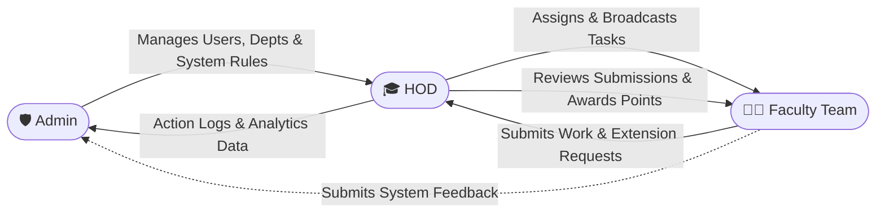
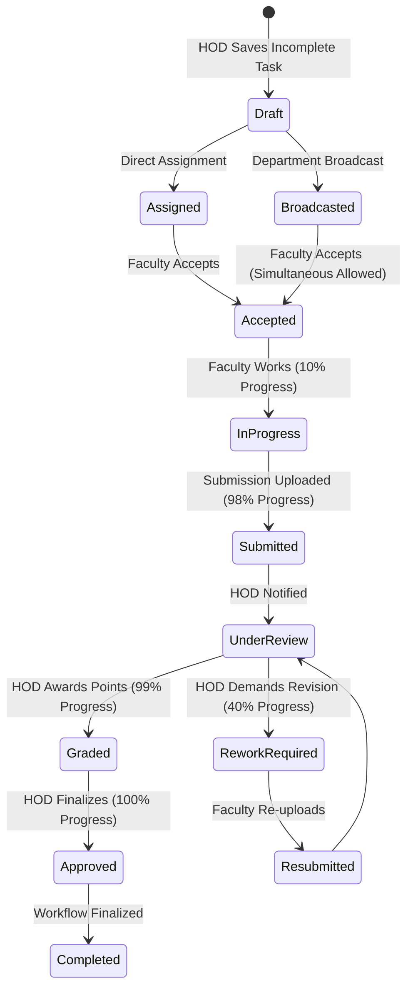

# ⚡ FlowSync - Faculty Task Management & Workflow System (FTMWS)

> **FlowSync** is a premium, multi-college, web-based task and academic workflow orchestration engine. It streamlines departmental productivity, optimizes task assignments, and unlocks deep performance analytics under a secure, responsive, and state-of-the-art Progressive Web App (PWA) wrapper.

---

## 🏗️ System Architecture & Workflow Flowcharts

### 1. Role Interaction & Workflow Architecture


### 2. Task Lifecycle State Diagram



---

## 🌟 Core Pillars & Capabilities

### 1. Unified Multi-Tenant Hierarchy
Designed with multi-college scalability at its core. Colleges operate under isolated environments while retaining absolute modular data containment:
$$\text{College} \longrightarrow \text{Departments} \longrightarrow \text{Faculty / Teams}$$

### 2. Simultaneous Broadcast Assignments
Replaces legacy locks with simultaneous execution. When an HOD broadcasts a task to the department:
- All eligible faculty members can view and accept the task.
- Multiple faculties can work on the same broadcasted task and receive points based on their individual submissions.

### 3. Global System Controls & Draft Mode
Admins have absolute control over the system's operational state:
- **Pause Task Postings**: If Admins restrict new tasks, HODs can still prepare tasks and save them in **Draft Mode** to be published once restrictions are lifted.
- **Maintenance Mode**: Easily pause non-essential activities across the board.
- **Global Multipliers**: Admins can configure global point multipliers for incentive campaigns.

### 4. Academic Seasons & Data Freezes
- **Terms Management**: Admin can create and configure academic semesters/years.
- **Default Season**: Easily assign which season is currently active across the system.
- **Season Locking**: Locks a season to freeze data. Once locked, tasks, submissions, points, and evaluations are set to read-only to prevent tampering.

### 5. Onboarding Verification checkpoint
- Prevents unconfigured accounts from accessing the dashboard.
- Forces default credential updates (password update from `flowsync`).
- Mandates setting a Profile Picture, Designation, and Contact Phone number.
- **WhatsApp Support Link**: Integrated directly into the onboarding modal for instant developer support.

### 6. Advanced Gamification (Leaderboard & Point System)
Tracks performance dynamically:
- Points are awarded on successful, timely completions.
- HODs can assign custom bonus points for extraordinary contributions.
- Generates rolling leaderboards showing performance consistency and efficiency.

### 7. Progressive Web App (PWA) & Offline Cache
Provides seamless mobile compatibility and network resilience:
- Built-in dynamic service worker caching standard assets (`/logo.png`, layout stylesheets, manifest protocols).
- Fallback **Offline Mode** page indicating connection disruptions.

### 8. Dynamic Auditing & Exporting
Comprehensive tracking for compliance:
- Every action (Login, Acceptance, Review, Override) is permanently logged in the Audit Trail.
- Admins can instantly export Task and User records to CSV/Excel for external reporting.

---

## 🎯 Feature Matrix

### 🛡️ Admin Features
- **Dashboard & Analytics**: High-level statistics of colleges, users, and tasks.
- **Global Settings Control**: Toggle Maintenance Mode, Pause New Tasks, set Max Bonus Points, and configure Global Point Multipliers.
- **Academic Seasons**: Add/Edit academic terms, designate system default seasons, and lock/unlock historic seasons.
- **Engagement Tracker**: Live monitoring of faculty and HOD interactions, login histories, system usage intensity, and task load averages.
- **Entity Management**: Full CRUD for Colleges, Departments, and User Accounts (HOD/Faculty).
- **Audit Logs**: View immutable logs of all system operations.
- **Feedback Center**: View and respond to system feedback submitted by users.
- **Bulk Exports**: Instantly download User and Task databases.

### 🎓 HOD Features
- **Mission Control**: Assign individual tasks or broadcast missions to the entire department.
- **Attachment Management**: Upload reference files (up to 35MB per file, zip and video formats blocked). Edit and delete task attachments at any time.
- **Drafts System**: Save incomplete tasks as drafts; useful when task-posting rules are paused.
- **Submissions & Bulk Review**: Review faculty submissions individually or approve multiple submissions in bulk. Award base points (multiplier-scaled) and bonus points.
- **Advanced Tracking**: Monitor which faculties have not yet accepted or completed their tasks, showing active workloads and delay intervals.
- **Extension Requests**: Review, approve, or reject deadline extensions requested by faculties.
- **Push Reminders**: Send immediate alert notifications to faculties lagging behind.
- **Department Groups**: Create custom faculty sub-groups for bulk task assignments. Can be toggled on/off in department configuration.
- **Turnaround Reports**: Turnaround charts and performance tables of department members.

### 👨‍🏫 Faculty Features
- **Task Workspace**: Accept/decline tasks, view detailed instructions, download attachments, and verify points.
- **Task Progress Milestones**:
  - **10%** - When a task is accepted/set to In Progress.
  - **98%** - When the deliverables are uploaded and task is submitted.
  - **99%** - When the HOD assigns points/marks.
  - **100%** - When finalized and approved by the HOD.
- **Extensions**: Request deadline extensions with formal reasoning directly from the task interface.
- **Comments & Communication**: Threaded task comments to discuss requirements with the HOD.
- **Leaderboard**: Track personal rank, total points, and completed tasks relative to peers.
- **Department Directory**: View department roster, workload metrics, and task distributions.
- **Feedback**: Submit system and workflow feedback directly to the Admin.
- **Public Profile**: Shareable user profiles showcasing bio, verified designation, contact details, and performance stats.

---

## 🛠️ Technology Stack

| Layer | Technology | Primary Role |
| :--- | :--- | :--- |
| **Frontend** | React 19 (TypeScript, Vite) | Reactive interfaces, rich glassmorphism UI, client state. |
| **Styling** | Vanilla CSS / TailwindCSS v4 | Sleek modern aesthetics, utility-first responsiveness, typography. |
| **Backend** | Native PHP 8+ | High-performance RESTful APIs, strict JWT authentication. |
| **Database** | MySQL 8+ | Transaction-safe schema with optimized index tables. |
| **Security** | JWT, Prepared SQL, Sanitization | Robust protection against SQLi, XSS, and authorization leaks. |

---

## 📂 Project Structure Walkthrough

```text
FlowSync/
├── backend/                  # PHP API Engine
│   ├── src/                  # Core Business Logic
│   │   ├── Config/           # Database & Connection settings
│   │   ├── Utils/            # Middleware, JWT, RBAC, Settings & Logging Guards
│   ├── public/               # API Gateway & Routing endpoints
│   │   ├── admin/            # Admin-specific API routes
│   │   ├── hod/              # HOD-specific API routes
│   │   └── faculty/          # Faculty-specific API routes
│   ├── sql/                  # DB Schemas, triggers, and indices
│   └── .env                  # Backend environments (Ignored in Git)
│
├── frontend/                 # React SPA Frontend
│   ├── public/               # Static resources (PWA Manifest, sw.js)
│   ├── src/                  # Application source
│   │   ├── components/       # Reusable components (SEO, Selectors, Modals)
│   │   ├── layouts/          # Dashboards (FacultyLayout, HODLayout, MainLayout)
│   │   ├── pages/            # Core views (Login, Maintenance, Admin/HOD/Faculty areas)
│   │   └── App.tsx           # Route definitions & state
│   ├── vite.config.ts        # Vite configuration & API proxies
│   └── .env                  # Frontend configuration
│
└── .gitignore                # Global repo ignore definitions
```

---

## 🚀 Setup & Installation

### Prerequisites
- **Web Server**: Apache/Nginx (PHP 8.0+ enabled, mod_rewrite active)
- **Database Server**: MySQL 8.0+
- **Package Manager**: Node.js & npm (v18+)

### 1. Database Configuration
1. Open your MySQL database manager.
2. Create a new database named `flowsync`.
3. Import the schema template found in `backend/sql/flowsync.sql`.

### 2. Backend Installation & Configurations
1. Navigate to the `backend` folder.
2. Create a `.env` file and populate it as follows:
   ```env
   DB_HOST=localhost
   DB_NAME=flowsync
   DB_USER=root
   DB_PASS=your_password
   JWT_SECRET=your_jwt_signing_key_secret
   JWT_EXPIRY=86400
   COOKIE_NAME=flowsync_session
   ALLOWED_ORIGINS=http://localhost:5173,https://flowsync.neodyit.in
   ```

### 3. Frontend Installation & Configurations
1. Navigate to the `frontend` folder:
   ```bash
   cd frontend
   ```
2. Install standard node modules:
   ```bash
   npm install
   ```
3. Initialize the development environment:
   ```bash
   npm run dev
   ```
4. To build assets for production webservers:
   ```bash
   npm run build
   ```

## 🚀 Performance Optimization & Concurrency Scaling

To support **1,000+ active concurrent users**, FlowSync incorporates critical database and architectural optimizations:

- **Batch Data Loading (N+1 Query Resolution)**:
  - Loop-based nested SQL queries on the Faculty and HOD task feeds were refactored into batch operations using `WHERE IN (...)` bindings. This optimization reduces database query execution counts by over **85%** on dashboard loads.
- **Write-Lock Contention Throttling**:
  - The heartbeat/active-session timestamp updates to the `users` table (`last_active_at`) are throttled. Writes are executed at most once every **5 minutes** per user, reducing index block contention on the core `users` table during high concurrent read operations.
- **Connection-Resilient Sessions**:
  - Session verification has been decoupled from transient connection dropouts. If the network drops or the server returns temporary 5xx errors, the frontend falls back gracefully to `localStorage` state rather than executing an immediate session termination/logout.
- **Server-Side Audit Searches**:
  - Transitioned the Audit Logs dashboard from client-side filtering (which was bounded by a 100-row query limit) to server-side dynamic SQL filters. Admins can search and query logs matching specific users, actions, timeframes, or keywords directly on the database level, ensuring historical accuracy.

---

## 🔒 Security Compliance Checklist

- [x] **Preparations**: Database connections strictly utilize prepared statements and parameterized bindings.
- [x] **Authentication**: Stateless validation using secure JWT cookies/headers on every HTTP query.
- [x] **File Upload Security & Size Constraints**:
  - **Profile Photos**: Max **10MB**, restricted to image formats (`jpg`, `jpeg`, `png`, `gif`, `webp`).
  - **Task Attachments**: Max **35MB** per file. Blocked formats include zip files (`.zip`) and video files (`.mp4`, `.mkv`, etc.).
  - **Push Notification Files**: Max **35MB** per file.
- [x] **Immutability**: Write-only ledger logging for logins, tasks, points, and status overrides inside the Audit log.

---

## 🎨 Design Philosophy & UX
FlowSync features a curated dark-and-light blended modern color palette, premium HSL tailored accent triggers, and high-fidelity micro-interactions backed by `framer-motion`. The UI responds seamlessly to any viewport, optimizing core tools like task boards and merit charts for desktop, tablet, and mobile screens alike.

---

## 💎 Development & Credits
FlowSync is designed, developed, and maintained under rigorous engineering and design quality guidelines.

**Created and Managed by [Neody IT](https://neodyit.com).**

---
*For systems support, technical questions, or integration procedures, please contact the Neody IT Operations team.*
