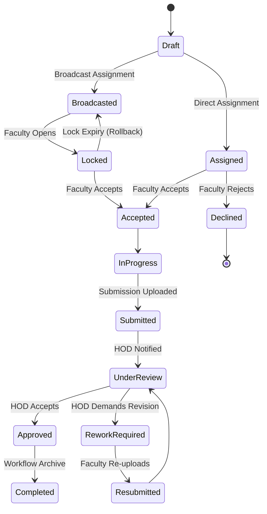

# ⚡ FlowSync — Faculty Task Management & Workflow System (FTMWS)

> **FlowSync** is a premium, multi-college, web-based task and academic workflow orchestration engine. It streamlines departmental productivity, optimizes task assignments, and unlocks deep performance analytics under a secure, responsive, and state-of-the-art Progressive Web App (PWA) wrapper.

```
       ┌────────────────────────────────────────────────────────┐
       │                       FlowSync                         │
       │           Academic Coordination Platform              │
       └───────────────────────────┬────────────────────────────┘
                                   │
         ┌─────────────────────────┼─────────────────────────┐
         ▼                         ▼                         ▼
   🛡️ SUPER ADMIN                🎓 HOD                  👨‍🏫 FACULTY
  System Orchestration     Department Command       Task Execution & Leaderboard
```

***

## 🌟 Core Pillars & Capabilities

### 1. Unified Multi-Tenant Hierarchy
Designed with multi-college scalability at its core. Colleges operate under isolated environments while retaining absolute modular data containment:
$$\text{College} \longrightarrow \text{Departments} \longrightarrow \text{Faculty / Teams}$$

### 2. Transactional Broadcast Lock System
Solves real-time race conditions in departmental broadcasts. When an HOD broadcasts a task to the department:
- The first faculty member to open the task triggers a secure **transactional lock** (30–60 seconds).
- Other department members see a locked status, preventing double-acceptance conflicts.
- Automatic rollbacks/unlocks trigger if the lock period expires without acceptance.

### 3. Dynamic Interactive Lifecycle
Tasks seamlessly transition through an advanced academic lifecycle:


### 4. Advanced Gamification (Leaderboard & Point System)
Tracks performance dynamically:
- Points are awarded on successful, timely completions.
- HODs can assign custom bonus points for extraordinary contributions.
- Generates rolling leaderboards showing performance consistency and efficiency.

### 5. Progressive Web App (PWA) & Offline Cache
Provides seamless mobile compatibility and network resilience:
- Built-in dynamic service worker caching standard assets (`/logo.png`, layout stylesheets, manifest protocols).
- Support for offline views and automatic database reconciliation once online access resumes.

### 6. Search Engine Optimization (SEO)
Fully configured dynamic metadata rendering using automated `<SEO>` component hydration, custom meta descriptions, OpenGraph tags for rich previews, and proper header structures.

---

## 🛠️ Technology Stack

| Layer | Technology | Primary Role |
| :--- | :--- | :--- |
| **Frontend** | React 19 (TypeScript) | Reactive interfaces, rich glassmorphism UI, client state. |
| **Styling** | TailwindCSS v4 | Sleek modern aesthetics, utility-first responsiveness, typography. |
| **Backend** | Native PHP 8+ | High-performance RESTful APIs, strict JWT authentication. |
| **Database** | MySQL 8+ | Transaction-safe schema with optimized index tables. |
| **Security** | JWT, Prepared SQL, Sanitization | Robust protection against SQLi, XSS, and authorization leaks. |

---

## 📂 Project Structure Walkthrough

```text
FlowSync/
├── backend/                  # PHP API Engine
│   ├── src/                  # Core Business Logic
│   │   ├── Config/           # Database & Connection settings
│   │   ├── Controllers/      # API Controllers (Authentication, Tasks, Audit)
│   │   ├── Middleware/       # JWT and RBAC guards
│   │   └── Models/           # Database abstractions
│   ├── public/               # API Gateway & Routing endpoints
│   ├── sql/                  # DB Schemas, triggers, and indices
│   └── .env                  # Backend environments (Ignored in Git)
│
├── frontend/                 # React SPA Frontend
│   ├── public/               # Static resources (PWA Manifest, sw.js, logo.png)
│   ├── src/                  # Application source
│   │   ├── components/       # Reusable components (SEO, Selectors, Modals)
│   │   ├── layouts/          # Dashboards (FacultyLayout, HODLayout, MainLayout)
│   │   ├── pages/            # Core views (Login, Tasks, Notifications, Analytics)
│   │   └── App.tsx           # Route definitions & state
│   ├── vite.config.ts        # Vite configuration & API proxies
│   └── .env                  # Frontend configuration
│
└── .gitignore                # Global repo ignore definitions
```

---

## 🚀 Setup & Installation

### Prerequisites
- **Web Server**: Apache/Nginx (PHP 8.0+ enabled, mod_rewrite active)
- **Database Server**: MySQL 8.0+
- **Package Manager**: Node.js & npm (v18+)

### 1. Database Configuration
1. Open your MySQL database manager (e.g., phpMyAdmin).
2. Create a new database named `flowsync`.
3. Import the schema template found in `backend/sql/schema.sql`.

### 2. Backend Installation & Configurations
1. Navigate to the `backend` folder.
2. Create a `.env` file (based on `backend/.env.example` if available, or populate it as follows):
   ```env
   DB_HOST=localhost
   DB_NAME=flowsync
   DB_USER=root
   DB_PASS=your_password
   JWT_SECRET=your_jwt_signing_key_secret
   JWT_EXPIRY=86400
   COOKIE_NAME=flowsync_session
   ALLOWED_ORIGINS=http://localhost:5173,https://flowsync.neodyit.in
   ```

### 3. Frontend Installation & Configurations
1. Navigate to the `frontend` folder:
   ```bash
   cd frontend
   ```
2. Install standard node modules:
   ```bash
   npm install
   ```
3. Initialize the development environment:
   ```bash
   npm run dev
   ```
4. To build assets for production webservers:
   ```bash
   npm run build
   ```

---

## 🔒 Security Compliance Checklist

- [x] **Preparations**: Database connections strictly utilize prepared statements and parameterized bindings.
- [x] **Authentication**: Stateless validation using secure JWT bearers on every HTTP header.
- [x] **File Security**: Strict MIME-type checks and custom sanitized storage keys on files uploaded.
- [x] **Immutability**: Write-only ledger logging for logins, tasks, points, and status overrides inside the Audit log.

---

## 🎨 Design Philosophy & UX
FlowSync features a curated dark-and-light blended modern color palette, premium HSL tailored accent triggers, and high-fidelity micro-interactions backed by `framer-motion`. The UI responds seamlessly to any viewport, optimizing core tools like task boards and merit charts for desktop, tablet, and mobile screens alike.

---

## 💎 Development & Credits
FlowSync is designed, developed, and maintained under rigorous engineering and design quality guidelines.

**Created and Managed by [Neody IT](https://neodyit.in).**

---
*For systems support, technical questions, or integration procedures, please contact the Neody IT Operations team.*
